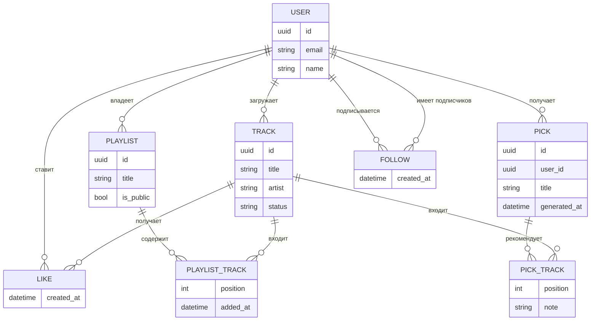
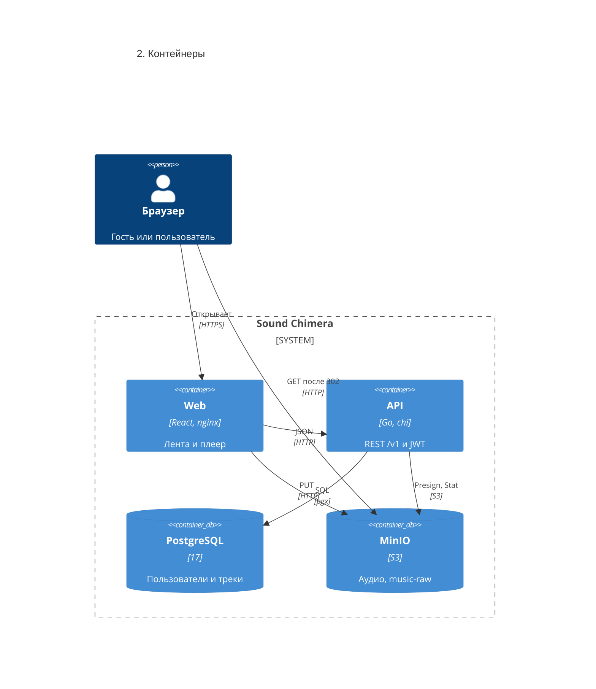

# Chimera — архитектурное описание

Документ собран по текущему коду: `README.md`, `docker-compose.yml`, `.env.example`, схема `backend/internal/infra/adapters/postgres/schema.sql`, домен и use case в `backend/internal`, HTTP API `backend/internal/transport/http`, клиент `frontend/`.

Продукт — **Sound Chimera**: веб-сервис, в котором автор публикует аудио, а слушатель играет публичный каталог готовых треков, ищет по артисту и собирает «любимое».

## 1. Цель работы

Дать автору прямой путь от файла до публичного эфира и дать слушателю каталог, который можно слушать без обязательной регистрации.

Решаемая проблема: прослушивать музыкальный контент в текущих реалиях можно либо с цензурой, либо без нее, но с использованием vpn, разрабатываемый сервис будет предоставлять удобные услуги прослушивания без цензур и ограничений.  

Возможность для пользователя:

- слушать ленту и каталог автора без аккаунта;
- зарегистрироваться, загружать треки и отмечать любимые;
- видеть свои загрузки, включая ещё не опубликованные.


## 2. Требования


### Функциональные


| ID   | Требование                                               | Как сделано сейчас                                                                     |
| ---- | -------------------------------------------------------- | -------------------------------------------------------------------------------------- |
| FR-1 | Регистрация и вход по email и паролю                     | `POST /v1/auth/register`, `POST /v1/auth/login`                                        |
| FR-2 | Публичная лента только треков                            | `GET /v1/tracks`                                                                       |
| FR-3 | Поиск ленты по точному имени артиста                     | query `artist`                                                                         |
| FR-4 | Публикация трека                                         | `POST /v1/tracks/upload-init`, PUT в хранилище, `POST /v1/tracks/{id}/upload-complete` |
| FR-5 | Воспроизведение готового трека                           | `GET /v1/tracks/{id}/stream` → `302` на временную ссылку                               |
| FR-6 | Лайк и снятие лайка, список любимого                     | `POST/DELETE /v1/tracks/{id}/like`, `GET /v1/me/likes`                                 |
| FR-7 | Свои загрузки всех статусов и публичный каталог автора   | `GET /v1/me/tracks`, `GET /v1/users/{id}/tracks`                                       |
| FR-8 | Профиль текущего пользователя и справочник пользователей | `GET /v1/me`, `GET /v1/users`, `GET /v1/users/{id}`                                    |


Мутации каталога, лайки и загрузка требуют `Authorization: Bearer <jwt>`. Чтение ленты, карточки трека, стрим и каталог автора — публичные.

### Нефункциональные

Измеримые пороги ниже — целевые требования, согласованные с уже заданными лимитами в коде и `.env.example`. Это не результаты нагрузочного прогона.

**Безопасность.** Пароль не короче 8 символов и хранится только как bcrypt-хеш; хеш в API не отдаётся. Неизвестный email и неверный пароль дают один и тот же ответ `unauthorized`. Мутации принимаются только с JWT HS256 со сроком `JWT_TTL` = 24 ч; пустой или неверный токен — 401. Прямая запись и чтение объекта живут не дольше `S3_PRESIGN_TTL` = 15 мин. Файл больше `TRACK_MAX_BYTES` = 104 857 600 (100 МиБ) не принимается. Браузерный доступ к API ограничен списком `HTTP_CORS_ORIGIN`.

**Rate limiter на аутентификации.** `POST /v1/auth/login` и `POST /v1/auth/register` ограничиваются до проверки пароля и до чтения таблицы пользователей. С одного IP — не больше 10 запросов на оба метода суммарно за 60 секунд. С одного email — не больше 5 неуспешных входов за 15 минут; успешный вход этот счётчик сбрасывает. Запрос сверх лимита получает `429` и заголовок `Retry-After` с числом секунд до конца окна, не меньше 1. Ответ 429 не сообщает, какая из двух квот сработала. В коде такого middleware ещё нет: это целевое требование к границе `transport/http`.

## 3. Диаграмма вариантов использования

Нотация UML use case в Mermaid. Овал — вариант использования, кружок — актор, пунктир со стереотипом — связь `include` или `extend`. Прямоугольник — граница системы. **Пользователь** обобщает **Гостя**: ему доступны все гостевые варианты плюс свои.

Подборки, плейлисты и подписки на диаграмме — целевые варианты. В текущем API их ещё нет; им соответствуют сущности раздела 6.

[draw.io](../schemas/usecase.drawio)

`Опубликовать трек` включает проверку размера, запись объекта и смену статуса. `Отметить любимое` и позиции плейлиста допускают только трек `ready`. `Слушать трек` для неготового трека завершается отказом `409`. `Искать по артисту` расширяет ленту тем же списком с фильтром `artist`.

## 4. BPMN основных процессов


[draw.io](../schemas/bpmn/processes.drawio) · [вход](../schemas/bpmn/auth.drawio) · [публикация](../schemas/bpmn/upload.drawio) · [прослушивание](../schemas/bpmn/play.drawio)


## 5. Пользовательские сценарии


### Сценарий 1. Гость слушает ленту

1. Гость открывает `/`. Клиент вызывает `GET /v1/tracks?limit=40`.
2. В списке только треки `ready`: название, артист, кнопка воспроизведения.
3. Гость нажимает play. Клиент запрашивает `GET /v1/tracks/{id}/stream` и получает редирект на объект.
4. Нижняя панель показывает название, артистa, паузу и перемотку.
5. Если лента пуста, остаётся текст «Пока пусто». Сердечко гостю не показывается.


### Сценарий 2. Автор публикует трек

1. Автор открывает `/upload`. Без сессии клиент уводит на `/auth`.
2. Он вводит название, артиста и выбирает файл. Клиент шлёт `POST /v1/tracks/upload-init` с `title`, `artist`, `size`.
3. API создаёт трек `pending` и возвращает `upload_url`. Браузер делает `PUT` файла по этой ссылке, минуя API.
4. Клиент вызывает `POST /v1/tracks/{id}/upload-complete`. API сверяет владельца и размер объекта, переводит трек в `ready`.
5. Автор попадает в `/library` и видит загрузку. Пока статус не `ready`, играть её нельзя; в общей ленте её нет.


### Сценарий 3. Пользователь собирает любимое

1. Пользователь входит (`POST /v1/auth/login`), токен кладётся в `localStorage` (`chimera.token`).
2. В ленте он нажимает сердечко. Клиент вызывает `POST /v1/tracks/{id}/like`.
3. Повторное нажатие вызывает `DELETE /v1/tracks/{id}/like`.
4. Экран `/likes` читает `GET /v1/me/likes` и показывает только готовые лайкнутые треки.
5. Если трек ещё не `ready`, и лайк, и play на клиенте недоступны; API лайк такого трека отвергает.


### Сценарий 4. Поиск каталога артиста

1. В шапке пользователь вводит имя артиста и отправляет форму.
2. Клиент открывает `/artist?q=...` и вызывает `GET /v1/tracks?artist=...`.
3. Совпадение точное, регистр и краевые пробелы не важны. Частичное совпадение не ищется.
4. Клик по имени артиста в строке трека ведёт на тот же экран. Пустой результат — «Готовых треков с таким артистом нет».


## 6. ER-диаграмма

Концептуальная модель. `USER`, `TRACK` и `LIKE` уже есть в PostgreSQL (раздел 8). `PLAYLIST`, `PLAYLIST_TRACK`, `PICK`, `PICK_TRACK` и `FOLLOW` — целевые сущности: в `schema.sql` их ещё нет.

[draw.io](../schemas/er.drawio)

`PICK` — подборка, которую система собирает для одного пользователя по его интересам. Интересы не хранятся отдельно: это его `LIKE`, `FOLLOW` и артисты этих треков. `PICK_TRACK.note` — почему система положила трек, не описание файла. `PLAYLIST` — личный или публичный список, который пользователь собирает сам. `FOLLOW` — подписка слушателя на автора.




Правила:

- email пользователя уникален;
- у трека ровно один загрузивший пользователь;
- лайк — связь «пользователь — трек», повторная пара недопустима;
- удаление пользователя или трека удаляет его лайки;
- в ленте, чужом каталоге, публичном плейлисте и подборке виден трек только со статусом `ready`;
- у плейлиста один владелец; пара «плейлист — трек» уникальна, `position` задаёт порядок;
- публичный плейлист (`is_public`) читается без входа, правит его только владелец;
- подборку собирает система для одного пользователя; новая генерация — новая строка `PICK` с `generated_at`, старые не затираются;
- `note` в `PICK_TRACK` объясняет выбор системы (лайк, подписка или артист), это не описание файла;
- подписка — пара пользователей «кто подписан — на кого», на самого себя не ставится;
- удаление трека убирает его из плейлистов и подборок, сами списки остаются.

Статусы трека: `pending` (карточка создана, файл ещё не подтверждён), `processing` (объект проверен, публикация не завершена), `ready` (можно стримить, лайкать и класть в списки).

## 7. Технологический стек


| Слой                | Выбор                                                                                                                                                                                                                               |
| ------------------- | ----------------------------------------------------------------------------------------------------------------------------------------------------------------------------------------------------------------------------------- |
| Язык и HTTP бэкенда | Go 1.26, `net/http`, роутер chi v5                                                                                                                                                                                                  |
| Контракт API        | REST `/v1`, JSON, Swagger (`swaggo`) на `/swagger/`                                                                                                                                                                                 |
| Аутентификация      | JWT HS256 (`golang-jwt`), пароли bcrypt (`golang.org/x/crypto`)                                                                                                                                                                     |
| Доступ к данным     | `pgx` v5, общий `pgxpool.Pool`                                                                                                                                                                                                      |
| Объектное хранилище | MinIO, клиент `minio-go` v7, presigned PUT/GET                                                                                                                                                                                      |
| Логи                | `log/slog`                                                                                                                                                                                                                          |
| Язык и UI фронтенда | TypeScript, React 19, React Router 7                                                                                                                                                                                                |
| Сборка фронтенда    | Vite 8                                                                                                                                                                                                                              |
| База данных         | PostgreSQL 17                                                                                                                                                                                                                       |
| Доставка            | Docker Compose: многоступенчатый образ API (`golang:1.26-alpine` → `alpine`, пользователь `chimera`), образ web (`node:22-alpine` → `nginx:1.27-alpine`). Nginx отдаёт SPA и проксирует `/v1`, `/swagger`, `/live`, `/ready` на API |


Секреты, порты и лимиты читаются из окружения (`internal/config`). Обязательные переменные без значения останавливают процесс на старте. Локальный шаблон — `.env.example`.

Слои бэкенда, зависимости только внутрь:

`transport/http` → `usecase` → `domain`.

Реализации портов снаружи: `infra/adapters/postgres`, `infra/adapters/s3`, `infra/auth`. Сборка графа — `cmd/api/main.go`: миграция схемы до создания репозиториев, затем health-monitor и HTTP.

## 8. Диаграмма базы данных

Физическая модель один к одному с ER из раздела 6. Импорт на [dbdiagram.io](https://dbdiagram.io): File → Import.

[DBML](../schemas/db/chimera.dbml)

`users`, `tracks` и `track_likes` уже создаёт `schema.sql`. `playlists`, `playlist_tracks`, `picks`, `pick_tracks` и `follows` в миграции ещё нет: в DBML они в группе `planned`.

```dbml
Table users {
  id uuid [pk]
  email text [not null, unique]
  name text [not null]
  password_hash text [not null]
  created_at timestamptz [not null]
}

Table tracks {
  id uuid [pk]
  user_id uuid [not null]
  title text [not null]
  artist text [not null]
  object_key text [not null]
  size_bytes bigint [not null]
  status text [not null]
  created_at timestamptz [not null]
}

Table track_likes {
  user_id uuid [pk]
  track_id uuid [pk]
  created_at timestamptz [not null]
}

Table playlists {
  id uuid [pk]
  owner_id uuid [not null]
  title text [not null]
  is_public boolean [not null]
  created_at timestamptz [not null]
}

Table playlist_tracks {
  playlist_id uuid [pk]
  track_id uuid [pk]
  position int [not null]
  added_at timestamptz [not null]
}

Table picks {
  id uuid [pk]
  user_id uuid [not null]
  title text [not null]
  generated_at timestamptz [not null]
}

Table pick_tracks {
  pick_id uuid [pk]
  track_id uuid [pk]
  position int [not null]
  note text [not null]
}

Table follows {
  follower_id uuid [pk]
  followee_id uuid [pk]
  created_at timestamptz [not null]
}

Ref: tracks.user_id > users.id
Ref: track_likes.user_id > users.id [delete: cascade]
Ref: track_likes.track_id > tracks.id [delete: cascade]
Ref: playlists.owner_id > users.id [delete: cascade]
Ref: playlist_tracks.playlist_id > playlists.id [delete: cascade]
Ref: playlist_tracks.track_id > tracks.id [delete: cascade]
Ref: picks.user_id > users.id [delete: cascade]
Ref: pick_tracks.pick_id > picks.id [delete: cascade]
Ref: pick_tracks.track_id > tracks.id [delete: cascade]
Ref: follows.follower_id > users.id [delete: cascade]
Ref: follows.followee_id > users.id [delete: cascade]
```

Индексы, которые уже есть в `schema.sql`:

- `tracks_user_id_idx` на `tracks(user_id)` — каталог автора и «мои треки»;
- `tracks_status_created_at_idx` на `tracks(status, created_at)` — лента готовых треков;
- `track_likes_user_created_idx` на `track_likes(user_id, created_at DESC)` — любимое.

`track_likes` имеет составной первичный ключ `(user_id, track_id)` и `ON DELETE CASCADE` с обеих сторон. `object_key` пустой по умолчанию: ключ объекта тогда выводится как `{id}.mp3`. Статус по умолчанию — `pending`. Удаление трека в целевой схеме убирает строки `playlist_tracks` и `pick_tracks`, сами списки остаются. Подписка на самого себя запрещена (`follower_id <> followee_id`).

Страница списка сейчас собирается в памяти: репозиторий возвращает весь отфильтрованный набор, `PageQuery.Page` отрезает срез по курсору-смещению. Курсор — десятичный индекс конца страницы.

## 9. C4

C4 — четыре масштаба одной системы. Следующий уровень раскрывает один блок предыдущего, формат элемента один и тот же: имя, технология, одна фраза о роли.


| Уровень       | Вопрос                                   | На диаграмме Chimera               |
| ------------- | ---------------------------------------- | ---------------------------------- |
| 1. Контекст   | Кто снаружи и зачем им система?          | Гость и пользователь, одна система |
| 2. Контейнеры | Из каких запускаемых частей она собрана? | Web, API, PostgreSQL, MinIO        |
| 3. Компоненты | Из каких частей собран один контейнер?   | Пакеты внутри API                  |
| 4. Код        | Из каких типов собран один компонент?    | Структуры `TrackService`           |


В [mermaid.live](https://mermaid.live) вставляй один блок. Уровни 1–3 — синтаксис C4. Уровня «код» в Mermaid нет, поэтому четвёртый уровень — `classDiagram`.

### 9.1. Контекст

Снаружи системы только люди. База и хранилище сюда не входят: это части самой Chimera.


Почты, платежей и CDN нет.

### 9.2. Контейнеры

Контейнер — то, что запускается отдельно. Файл в API не заходит: браузер пишет и читает объект по временной ссылке.




### 9.3. Компоненты API

Компонент — папка с одной ролью внутри контейнера API. Все записаны одинаково: `Component(код, "Имя", "технология", "роль")`. Границы — слои, сверху вниз.


Порты объявлены на стороне потребителя (`usecase/ports.go`): репозитории, `ObjectStorage`, `PasswordHasher`, `TokenIssuer`. Контроллеры зависят от узких интерфейсов в `transport/http/v1/ports.go`, а не от конкретных сервисов. Регистрация и профиль пишут в тот же Postgres (`AuthUserRepository`, `UserRepository`). `RequireAuth` разбирает токен тем же JWT-адаптером, что и `AuthService`.

Пул воркеров (`WORKER_POOL_SIZE`, по умолчанию 4) поднимается в `main` и передаётся в health-monitor. Бизнес-задач (транскодинг, обложки) он пока не выполняет: публикация трека синхронная, внутри `CompleteUpload`.

## 10. Архитектурные решения


### ADR-1. Прямая загрузка и стрим через presigned URL

**Статус:** принято.

**Контекст.** Аудиофайл до 100 МиБ. Если гнать байты через API, процесс держит тело запроса, упирается в память и в таймаут, а горизонтальное масштабирование API начинает означать масштабирование диска.

**Решение.** `InitUpload` создаёт строку `pending` и подписывает `PUT` на ключ `{id}.mp3` на 15 минут. Браузер пишет объект в MinIO. `CompleteUpload` проверяет владельца и размер (`Stat`) и публикует трек. Стрим — `302` на подписанный `GET` с тем же сроком. При ошибке подписи строка трека удаляется.

**Альтернативы.**

- Проксировать файл через `multipart/form-data` в API. Проще для клиента и для антивируса на границе, но API становится узким местом по трафику и должен сам ограничивать тело запроса.
- Загрузка чанками с сборкой на API. Нужна для докачки больших файлов; для лимита 100 МиБ и одного `PUT` это лишняя машина состояний.

**Почему так.** Лимит уже 100 МиБ, клиент и так знает размер до старта, а хранилище отделено от API. Подпись живёт 15 минут, постоянной публичной ссылки на бакет нет.

### ADR-2. Clean Architecture и порты на стороне потребителя

**Статус:** принято.

**Контекст.** Нужно тестировать сценарии загрузки, ленты и входа без PostgreSQL и MinIO и не тащить HTTP и SQL в правила трека.

**Решение.** Домен (`internal/domain`) не импортирует HTTP, SQL и JWT. Валидация живёт на моделях входа (`Validate`, `ValidateCreate`, `ValidateSize`). Use case только оркестрирует: вызвать валидацию, репозиторий, хранилище, сменить статус. Интерфейсы репозитория, хранилища, хешера и токенов объявлены в `usecase`, интерфейсы сервисов — в пакете контроллеров. Конструкторы возвращают конкретные структуры. Схема БД применяется в `main` до создания репозиториев, не из методов репозитория.

**Альтернативы.**

- Слой «сервис + репозиторий» в одном пакете, SQL рядом с правилами статуса. Быстрее на старте, но тест публикации начинает требовать базу, а смена хранилища задевает домен.
- Гексагональные порты, объявленные в `domain`. Домен тогда знает технические операции `PresignPut` и `Stat`, которые ему не принадлежат.

**Почему так.** Статусы трека и проверки владельца, размера и пароля остаются чистыми и покрываются unit-тестами. Подмена Postgres и MinIO — это другие реализации тех же портов, тестовые двойники живут в `*_test.go`.

