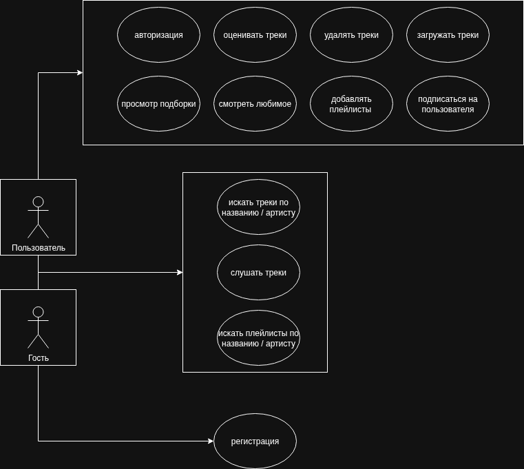
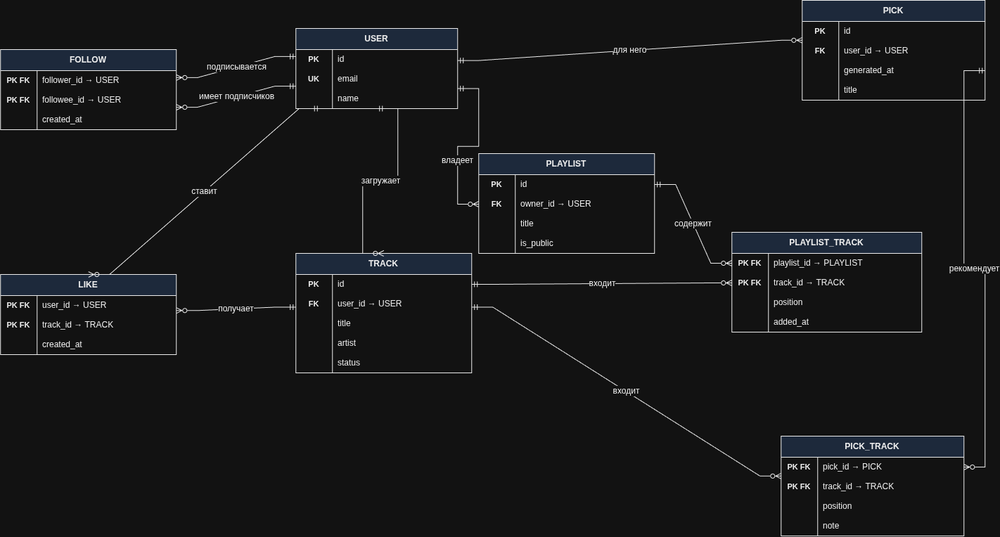
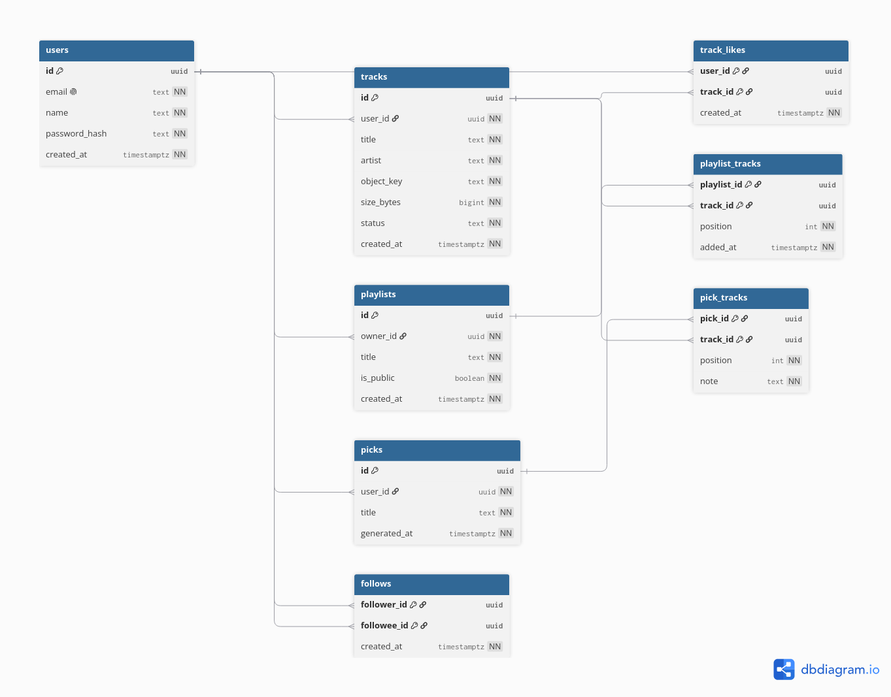
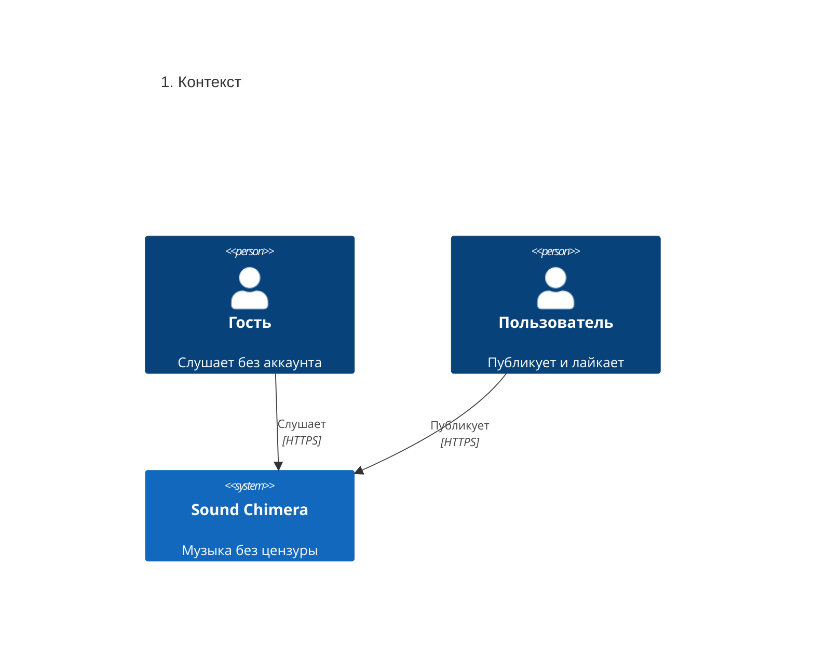
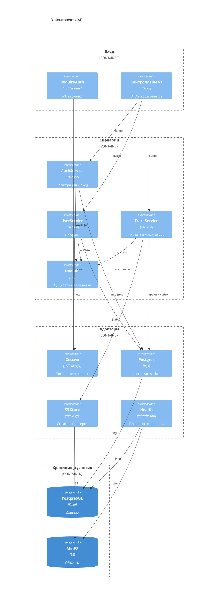

# Chimera — архитектурное описание

**Sound Chimera** — универсальный веб-сервис для прослушивания музыки без цензуры и ограничений. Слушатель открывает каталог и играет готовые треки без регистрации. Автор сам публикует файл, и трек попадает в общий эфир.

## 1. Цель работы

Сделать сервис, в котором музыку можно слушать без цензуры и без обязательных посредников.

Сейчас прослушивание упирается либо в отбор контента, либо в обходные средства вроде VPN. Chimera даёт прямой каталог: гость слушает, автор публикует, пользователь отмечает любимое.

Пользователь может:

- слушать ленту и каталог автора без аккаунта;
- зарегистрироваться, загружать треки и отмечать любимые;
- видеть свои загрузки, включая ещё не опубликованные.

## 2. Требования

### Функциональные

| ID   | Требование                               | Как сделано сейчас                                                                        |
| ---- | ---------------------------------------- | ----------------------------------------------------------------------------------------- |
| FR-1 | Регистрация и вход по email и паролю     | `POST /v1/auth/register`, `POST /v1/auth/login`                                           |
| FR-2 | Публичная лента готовых треков           | `GET /v1/tracks`                                                                          |
| FR-3 | Поиск ленты по имени артиста             | query `artist`                                                                            |
| FR-4 | Публикация трека                         | `POST /v1/tracks/upload-init`, запись в хранилище, `POST /v1/tracks/{id}/upload-complete` |
| FR-5 | Воспроизведение готового трека           | `GET /v1/tracks/{id}/stream` ведёт на временную ссылку                                    |
| FR-6 | Лайк, снятие лайка, список любимого      | `POST/DELETE /v1/tracks/{id}/like`, `GET /v1/me/likes`                                    |
| FR-7 | Свои загрузки и публичный каталог автора | `GET /v1/me/tracks`, `GET /v1/users/{id}/tracks`                                          |
| FR-8 | Профиль и справочник пользователей       | `GET /v1/me`, `GET /v1/users`, `GET /v1/users/{id}`                                       |

Загрузка, лайки и остальные изменения каталога требуют токен. Лента, карточка трека, стрим и каталог автора открыты без входа.

Целевой контракт — [OpenAPI](openapi.yaml). Что уже есть в коде и таблица сценариев — [api.md](api.md).

### Нефункциональные

**Доступ.** Готовый трек можно слушать без регистрации. Каталог не режется по содержанию: публикация и прослушивание не проходят модерацию.

**Файлы.** Аудио пишется и читается по короткой временной ссылке, не через API. Слишком большой файл не принимается.

**Вход.** Регистрация и вход ограничиваются по IP до проверки пароля. Число запросов и окно задают `AUTH_RATE_LIMIT` и `AUTH_RATE_WINDOW`. Отказ не сообщает, какая квота сработала. Счётчик живёт в памяти процесса.

## 3. Диаграмма вариантов использования

**Пользователь** обобщает **Гостя**: ему доступны гостевые варианты и свои. Подборки, плейлисты и подписки на диаграмме — цель, в API их ещё нет (раздел 6).

`Опубликовать трек` включает проверку размера, запись объекта и смену статуса. В любимое, плейлист и подборку попадает только готовый трек. Неготовый трек нельзя ни лайкнуть, ни слушать. Поиск по артисту — та же лента с фильтром.

## 4. BPMN основных процессов

### Регистрация и вход

### Прослушивание трека

### Постановка лайка

## 5. Пользовательские сценарии

### Сценарий 1. Гость слушает ленту

1. Гость открывает ленту. В списке только готовые треки: название, артист, воспроизведение.
2. Нажатие play запрашивает стрим и получает ссылку на объект.
3. Нижняя панель показывает название, артиста, паузу и перемотку.

### Сценарий 2. Автор публикует трек

1. Автор открывает загрузку. Без сессии клиент уводит на вход.
2. Он вводит название, артиста и выбирает файл.
3. Браузер отправляет файл в хранилище.
4. Клиент подтверждает загрузку.
5. Автор видит загрузку у себя. 

### Сценарий 3. Пользователь собирает любимое

1. Пользователь входит.
2. В ленте он ставит или снимает сердечко.
3. Экран любимого показывает только готовые лайкнутые треки.

### Сценарий 4. Поиск каталога артиста

1. Пользователь вводит имя артиста в шапке.
2. Клиент открывает каталог артиста и запрашивает ленту с этим фильтром.
3. Совпадение точное, без учёта регистра и краевых пробелов.
4. Клик по имени артиста в строке трека ведёт на тот же экран. Пустой результат — «Готовых треков с таким артистом нет».

## 6. ER-диаграмма

## 7. Технологический стек

| Слой   | Выбор                                      |
| ------ | ------------------------------------------ |
| API    | Go, `net/http`, chi                        |
| Сессия | JWT, пароли bcrypt                         |
| Данные | PostgreSQL, `pgx`                          |
| Файлы  | MinIO, временные ссылки на запись и чтение |
| Логи   | `log/slog`                                 |
| Клиент | TypeScript, React, React Router, Vite      |

Секреты, порты и лимиты читаются из окружения. Без обязательной переменной процесс не стартует.

Зависимости бэкенда идут внутрь: `transport/http` → `usecase` → `domain`. Реализации портов — `infra`. Сборка в `cmd/api/main.go`: сначала схема базы, затем репозитории, health-monitor и HTTP.

## 8. Диаграмма базы данных

`users`, `tracks` и `track_likes` уже создаёт миграция. Плейлисты, подборки и подписки в ней ещё нет.

Уже есть индексы каталога автора, ленты готовых треков и любимого. Лайк удаляется вместе с пользователем и треком. Пустой ключ объекта выводится из идентификатора трека. Новый трек создаётся как `pending`. Страница списка отрезается в памяти от уже отфильтрованного набора.

## 9. C4

### 9.1. Контекст

Снаружи только люди. База и хранилище — части самой системы.

Почты, платежей и CDN нет.

### 9.2. Контейнеры

Файл в API не заходит: браузер пишет и читает объект по временной ссылке.

### 9.3. Компоненты API

Компонент — папка с одной ролью внутри API. Границы — слои, сверху вниз.

Порты объявлены там, где их вызывают: репозитории, хранилище, хеш пароля и выпуск токена — в сценариях, сервисы — в контроллерах. Регистрация и профиль пишут в тот же Postgres. Проверка входа разбирает токен тем же адаптером, что и вход в аккаунт.

Пул воркеров поднимается при старте и обслуживает проверку живости. Публикация трека идёт синхронно, отдельных фоновых задач у неё нет.

## 10. Архитектурные решения

### ADR-1. Файл идёт мимо API

**Контекст.** Аудио тяжёлое. Если гнать байты через API, процесс держит тело запроса и упирается в память и таймаут.

**Решение.** Создание трека возвращает временную ссылку на запись. Браузер пишет объект в MinIO. Подтверждение сверяет владельца и размер и публикует трек. Стрим — переход на временную ссылку чтения. Если ссылку выдать не удалось, строка трека удаляется.

**Альтернативы.** Проксировать файл через API проще для клиента, но API становится узким местом. Сборка файла по частям нужна для докачки, для одной записи это лишняя машина состояний.

**Почему так.** Клиент знает размер до старта, хранилище отдельно от API, постоянной публичной ссылки на бакет нет.

### ADR-2. Слои и порты на стороне потребителя

**Контекст.** Сценарии загрузки, ленты и входа нужно проверять без базы и хранилища. Правила трека не должны знать про HTTP и SQL.

**Решение.** Домен не импортирует HTTP, SQL и JWT. Проверки живут на моделях входа. Сценарий только вызывает проверку, репозиторий и хранилище и меняет статус. Интерфейсы объявлены у того, кто их вызывает. Схема базы применяется при старте, до создания репозиториев.

**Альтернативы.** SQL рядом с правилами статуса быстрее на старте, но тест публикации начинает требовать базу. Если порты объявить в домене, домен узнает про технические операции хранилища.

**Почему так.** Статусы и проверки владельца, размера и пароля покрываются тестами без Postgres и MinIO. Подмена хранилищ — другие реализации тех же портов.
