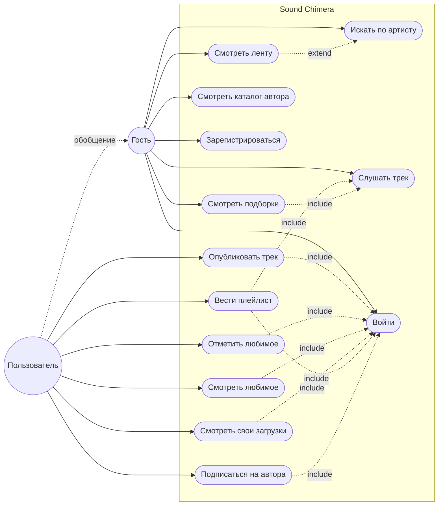
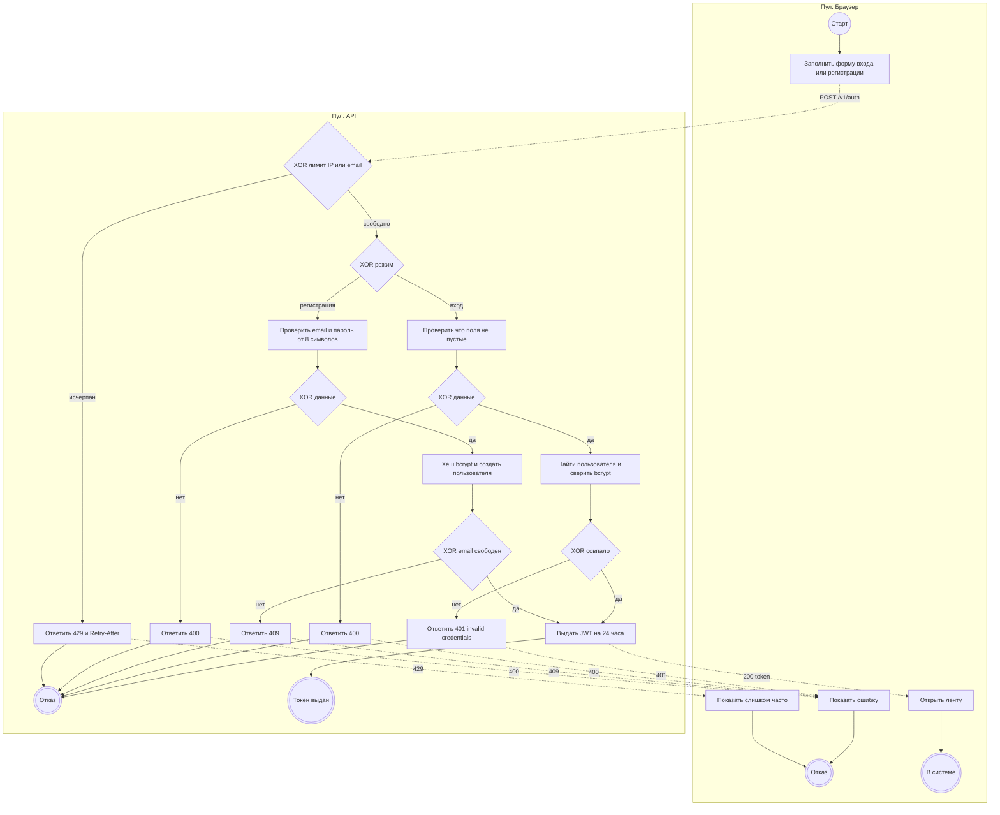
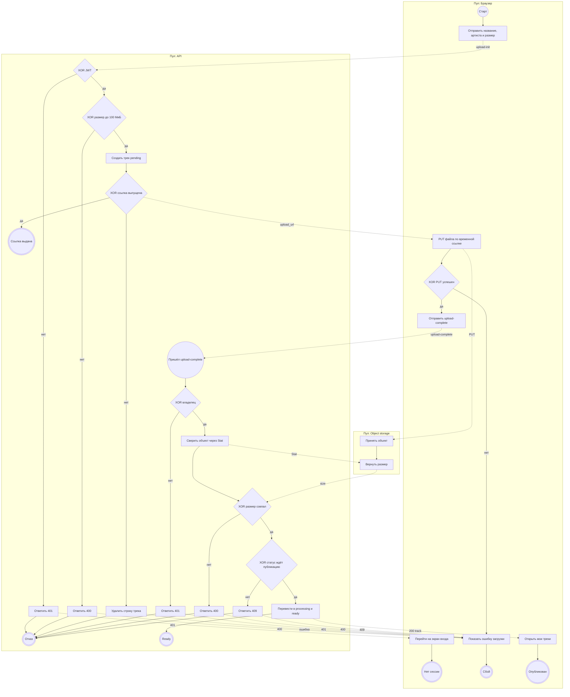
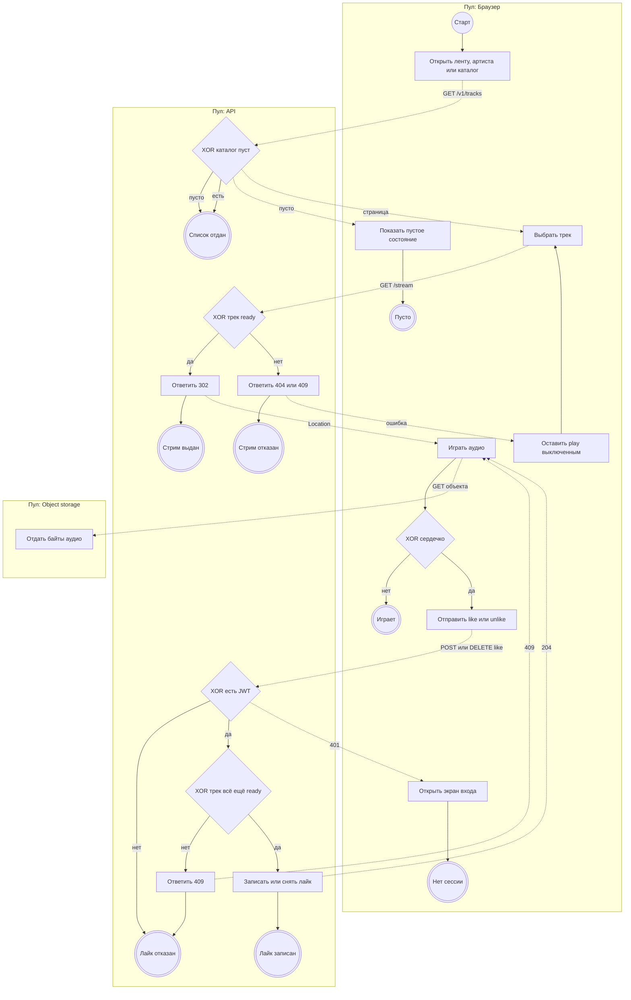
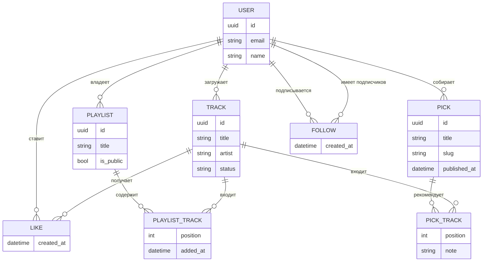
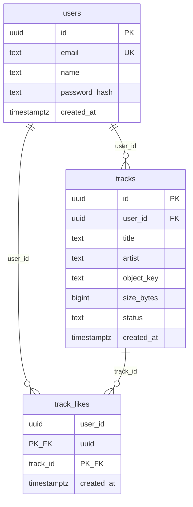
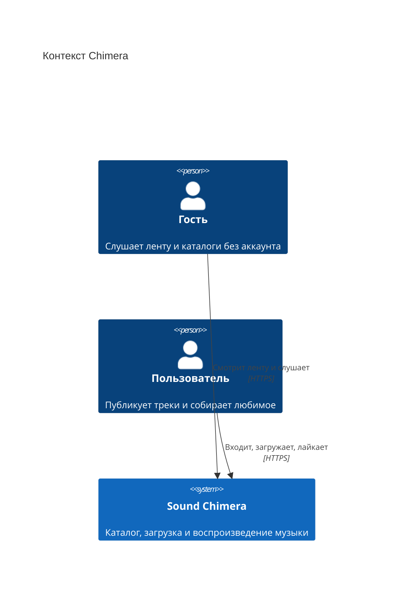
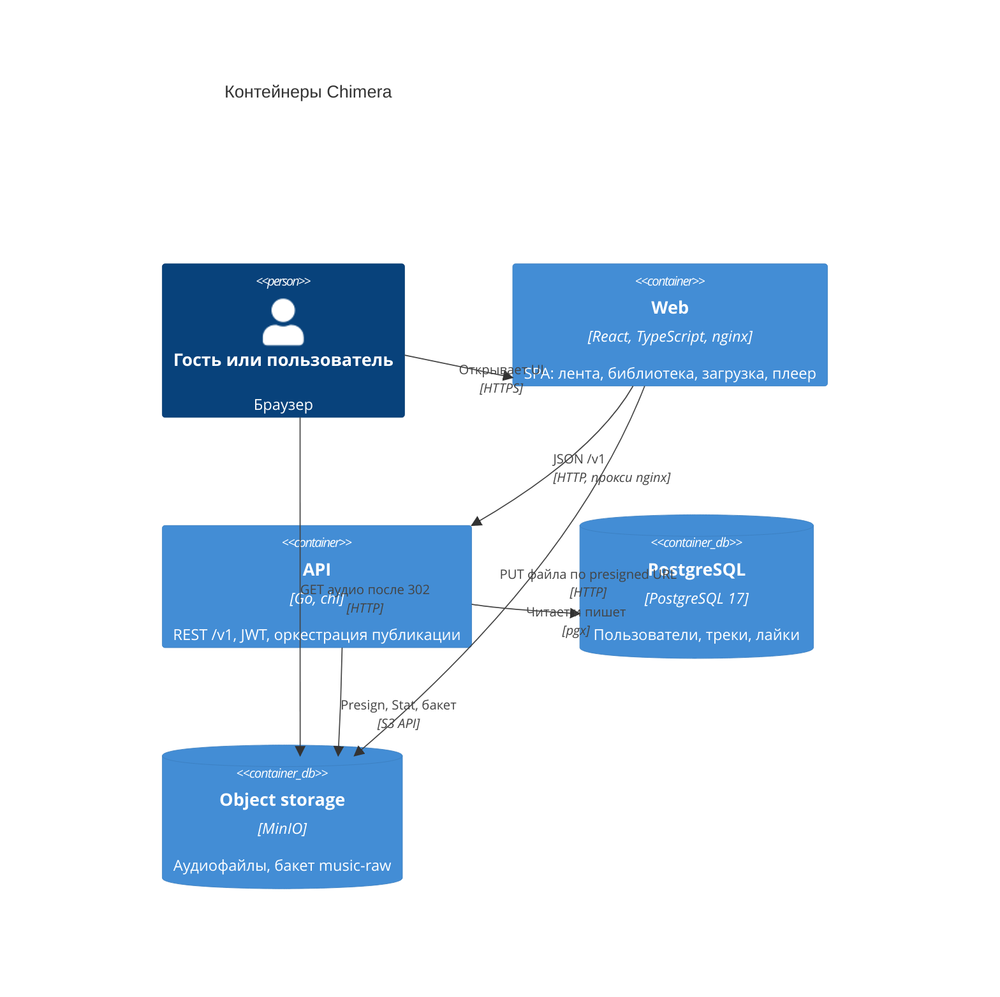
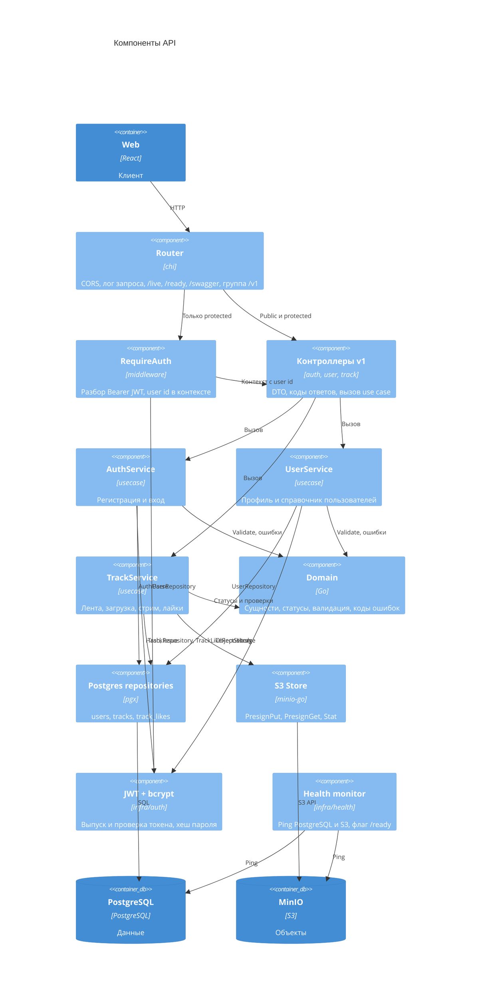

# Chimera — архитектурное описание

Документ собран по текущему коду: `README.md`, `docker-compose.yml`, `.env.example`, схема `backend/internal/infra/adapters/postgres/schema.sql`, домен и use case в `backend/internal`, HTTP API `backend/internal/transport/http`, клиент `frontend/`.

Продукт — **Sound Chimera**: веб-сервис, в котором автор публикует аудио, а слушатель играет публичный каталог готовых треков, ищет по артисту и собирает «любимое».

## 1. Цель работы

Дать автору прямой путь от файла до публичного эфира и дать слушателю каталог, который можно слушать без обязательной регистрации.

Решаемая проблема: прослушивать музыкальный контент в текущих реалиях можно либо с цензурой, либо без нее, но с использованием vpn, разрабатываемый сервис будет предоставлять удобные услуги прослушивания без цензур и ограничений.  

Возможность для пользователя:

- слушать ленту и каталог автора без аккаунта;
- зарегистрироваться, загружать треки и отмечать любимые;
- видеть свои загрузки, включая ещё не опубликованные.

## 2. Требования

### Функциональные

| ID | Требование | Как сделано сейчас |
| --- | --- | --- |
| FR-1 | Регистрация и вход по email и паролю | `POST /v1/auth/register`, `POST /v1/auth/login` |
| FR-2 | Публичная лента только треков | `GET /v1/tracks` |
| FR-3 | Поиск ленты по точному имени артиста  | query `artist` |
| FR-4 | Публикация трека| `POST /v1/tracks/upload-init`, PUT в хранилище, `POST /v1/tracks/{id}/upload-complete` |
| FR-5 | Воспроизведение готового трека | `GET /v1/tracks/{id}/stream` → `302` на временную ссылку |
| FR-6 | Лайк и снятие лайка, список любимого | `POST/DELETE /v1/tracks/{id}/like`, `GET /v1/me/likes` |
| FR-7 | Свои загрузки всех статусов и публичный каталог автора | `GET /v1/me/tracks`, `GET /v1/users/{id}/tracks` |
| FR-8 | Профиль текущего пользователя и справочник пользователей | `GET /v1/me`, `GET /v1/users`, `GET /v1/users/{id}` |

Мутации каталога, лайки и загрузка требуют `Authorization: Bearer <jwt>`. Чтение ленты, карточки трека, стрим и каталог автора — публичные.

### Нефункциональные

Измеримые пороги ниже — целевые требования, согласованные с уже заданными лимитами в коде и `.env.example`. Это не результаты нагрузочного прогона.

**Производительность.** p95 ответа `GET /v1/tracks` при `limit` ≤ 20 и каталоге до 10 000 треков `ready` — не более 300 мс при 50 одновременных запросах. Время скачивания аудио из объектного хранилища в этот бюджет не входит. В коде страница по умолчанию 20 элементов, потолок 100 (`defaultPageLimit`, `maxPageLimit` в `domain/page.go`); `limit` выше 100 отклоняется как `invalid`.

**Надёжность.** `GET /ready` переходит в неготовое состояние, если проверка PostgreSQL или S3 не укладывается в `HEALTH_CHECK_TIMEOUT` = 3 с, и снова становится готовой не позднее одного интервала `HEALTH_CHECK_INTERVAL` = 10 с после восстановления зависимости. Остановка процесса завершает приём HTTP не дольше `HTTP_SHUTDOWN_TIMEOUT` = 3 с. Если выпуск ссылки на загрузку не удался, созданная строка трека удаляется (`TrackService.InitUpload`).

**Безопасность.** Пароль не короче 8 символов и хранится только как bcrypt-хеш; хеш в API не отдаётся. Неизвестный email и неверный пароль дают один и тот же ответ `unauthorized`. Мутации принимаются только с JWT HS256 со сроком `JWT_TTL` = 24 ч; пустой или неверный токен — 401. Прямая запись и чтение объекта живут не дольше `S3_PRESIGN_TTL` = 15 мин. Файл больше `TRACK_MAX_BYTES` = 104 857 600 (100 МиБ) не принимается. Браузерный доступ к API ограничен списком `HTTP_CORS_ORIGIN`.

**Rate limiter на аутентификации.** `POST /v1/auth/login` и `POST /v1/auth/register` ограничиваются до проверки пароля и до чтения таблицы пользователей. С одного IP — не больше 10 запросов на оба метода суммарно за 60 секунд. С одного email — не больше 5 неуспешных входов за 15 минут; успешный вход этот счётчик сбрасывает. Запрос сверх лимита получает `429` и заголовок `Retry-After` с числом секунд до конца окна, не меньше 1. Ответ 429 не сообщает, какая из двух квот сработала. В коде такого middleware ещё нет: это целевое требование к границе `transport/http`.

## 3. Диаграмма вариантов использования

Нотация UML use case в Mermaid. Овал — вариант использования, кружок — актор, пунктир со стереотипом — связь `include` или `extend`. Прямоугольник — граница системы. **Пользователь** обобщает **Гостя**: ему доступны все гостевые варианты плюс свои.

Подборки, плейлисты и подписки на диаграмме — целевые варианты. В текущем API их ещё нет; им соответствуют сущности раздела 6.



`Опубликовать трек` включает проверку размера, запись объекта и смену статуса. `Отметить любимое` и позиции плейлиста допускают только трек `ready`. `Слушать трек` для неготового трека завершается отказом `409`. `Искать по артисту` расширяет ленту тем же списком с фильтром `artist`.

## 4. BPMN основных процессов

Нотация BPMN 2.0, диаграмма взаимодействия. Участник — пул. Сплошная стрелка не выходит за границу пула: это поток управления. Пунктир между пулами — поток сообщений. Круг — стартовое событие, двойной круг — конечное. Прямоугольник — задача. Ромб с подписью `XOR` — исключающий шлюз: срабатывает ровно одна исходящая ветка.

| Элемент BPMN 2.0 | На диаграмме |
| --- | --- |
| Стартовое событие | круг |
| Конечное событие | двойной круг |
| Задача | прямоугольник |
| Шлюз XOR | ромб |
| Поток управления | сплошная стрелка внутри пула |
| Поток сообщений | пунктир между пулами |

### 4.1. Регистрация и вход



Лимитер — первый шлюз в пуле API. Счётчики IP и email растут до bcrypt и до чтения пользователя. Снаружи неизвестный email и неверный пароль — один и тот же `401`.

### 4.2. Публикация трека



В пуле API два старта одного процесса: обычный — на `upload-init`, по сообщению — на `upload-complete`. Пока файл не лежит в хранилище, публикация не продолжается. Если ссылку выпустить не удалось, строка `pending` удаляется. В ленту попадает только `ready`.

### 4.3. Прослушивание и «любимое»



Список, стрим и лайк — три отдельных захода в пул API, каждый со своим конечным событием. Поток управления ленты не перескакивает в стрим: браузер сам шлёт следующее сообщение. Неготовый трек возвращает на выбор, не начиная плеер.

## 5. Пользовательские сценарии

### Сценарий 1. Гость слушает ленту

1. Гость открывает `/`. Клиент вызывает `GET /v1/tracks?limit=40`.
2. В списке только треки `ready`: название, артист, кнопка воспроизведения.
3. Гость нажимает play. Клиент запрашивает `GET /v1/tracks/{id}/stream` и получает редирект на объект.
4. Нижняя панель показывает название, артистa, паузу и перемотку.
5. Если лента пуста, остаётся текст «Пока пусто». Сердечко гостю не показывается.

### Сценарий 2. Автор публикует трек

1. Автор открывает `/upload`. Без сессии клиент уводит на `/auth`.
2. Он вводит название, артиста и выбирает файл. Клиент шлёт `POST /v1/tracks/upload-init` с `title`, `artist`, `size`.
3. API создаёт трек `pending` и возвращает `upload_url`. Браузер делает `PUT` файла по этой ссылке, минуя API.
4. Клиент вызывает `POST /v1/tracks/{id}/upload-complete`. API сверяет владельца и размер объекта, переводит трек в `ready`.
5. Автор попадает в `/library` и видит загрузку. Пока статус не `ready`, играть её нельзя; в общей ленте её нет.

### Сценарий 3. Пользователь собирает любимое

1. Пользователь входит (`POST /v1/auth/login`), токен кладётся в `localStorage` (`chimera.token`).
2. В ленте он нажимает сердечко. Клиент вызывает `POST /v1/tracks/{id}/like`.
3. Повторное нажатие вызывает `DELETE /v1/tracks/{id}/like`.
4. Экран `/likes` читает `GET /v1/me/likes` и показывает только готовые лайкнутые треки.
5. Если трек ещё не `ready`, и лайк, и play на клиенте недоступны; API лайк такого трека отвергает.

### Сценарий 4. Поиск каталога артиста

1. В шапке пользователь вводит имя артиста и отправляет форму.
2. Клиент открывает `/artist?q=...` и вызывает `GET /v1/tracks?artist=...`.
3. Совпадение точное, регистр и краевые пробелы не важны. Частичное совпадение не ищется.
4. Клик по имени артиста в строке трека ведёт на тот же экран. Пустой результат — «Готовых треков с таким артистом нет».

## 6. ER-диаграмма

Концептуальная модель. `USER`, `TRACK` и `LIKE` уже есть в PostgreSQL (раздел 8). `PLAYLIST`, `PLAYLIST_TRACK`, `PICK`, `PICK_TRACK` и `FOLLOW` — целевые сущности: в `schema.sql` их ещё нет.

`PICK` — подборка рекомендуемых треков: именованный список с порядком и короткой пометкой, почему трек в него попал. Подборку собирает пользователь-редактор. `PLAYLIST` — личный или публичный список владельца. `FOLLOW` — подписка слушателя на автора.



Правила:

- email пользователя уникален;
- у трека ровно один загрузивший пользователь;
- лайк — связь «пользователь — трек», повторная пара недопустима;
- удаление пользователя или трека удаляет его лайки;
- в ленте, чужом каталоге, публичном плейлисте и подборке виден трек только со статусом `ready`;
- у плейлиста один владелец; пара «плейлист — трек» уникальна, `position` задаёт порядок;
- публичный плейлист (`is_public`) читается без входа, правит его только владелец;
- у подборки один составитель; `slug` уникален; `note` — причина рекомендации, не описание файла;
- подписка — пара пользователей «кто подписан — на кого», на самого себя не ставится;
- удаление трека убирает его из плейлистов и подборок, сами списки остаются.

Статусы трека: `pending` (карточка создана, файл ещё не подтверждён), `processing` (объект проверен, публикация не завершена), `ready` (можно стримить, лайкать и класть в списки).

## 7. Технологический стек

| Слой | Выбор |
| --- | --- |
| Язык и HTTP бэкенда | Go 1.26, `net/http`, роутер chi v5 |
| Контракт API | REST `/v1`, JSON, Swagger (`swaggo`) на `/swagger/` |
| Аутентификация | JWT HS256 (`golang-jwt`), пароли bcrypt (`golang.org/x/crypto`) |
| Доступ к данным | `pgx` v5, общий `pgxpool.Pool` |
| Объектное хранилище | MinIO, клиент `minio-go` v7, presigned PUT/GET |
| Логи | `log/slog` |
| Язык и UI фронтенда | TypeScript, React 19, React Router 7 |
| Сборка фронтенда | Vite 8 |
| База данных | PostgreSQL 17 |
| Доставка | Docker Compose: многоступенчатый образ API (`golang:1.26-alpine` → `alpine`, пользователь `chimera`), образ web (`node:22-alpine` → `nginx:1.27-alpine`). Nginx отдаёт SPA и проксирует `/v1`, `/swagger`, `/live`, `/ready` на API |

Секреты, порты и лимиты читаются из окружения (`internal/config`). Обязательные переменные без значения останавливают процесс на старте. Локальный шаблон — `.env.example`.

Слои бэкенда, зависимости только внутрь:

`transport/http` → `usecase` → `domain`.

Реализации портов снаружи: `infra/adapters/postgres`, `infra/adapters/s3`, `infra/auth`. Сборка графа — `cmd/api/main.go`: миграция схемы до создания репозиториев, затем health-monitor и HTTP.

## 8. Диаграмма базы данных

Физическая схема того, что уже создаёт `schema.sql`. Плейлисты, подборки и подписки из раздела 6 в базе ещё не заведены.



Индексы из `schema.sql`:

- `tracks_user_id_idx` на `tracks(user_id)` — каталог автора и «мои треки»;
- `tracks_status_created_at_idx` на `tracks(status, created_at)` — лента готовых треков;
- `track_likes_user_created_idx` на `track_likes(user_id, created_at DESC)` — любимое.

`track_likes` имеет составной первичный ключ `(user_id, track_id)` и `ON DELETE CASCADE` с обеих сторон. `object_key` пустой по умолчанию: ключ объекта тогда выводится как `{id}.mp3`. Статус по умолчанию — `pending`.

Страница списка сейчас собирается в памяти: репозиторий возвращает весь отфильтрованный набор, `PageQuery.Page` отрезает срез по курсору-смещению. Курсор — десятичный индекс конца страницы.

## 9. C4

### 9.1. Контекст



Внешних систем за периметром Compose нет: почта, платежи и CDN не подключены. PostgreSQL и MinIO — контейнеры самой системы, они на контекстной диаграмме не вынесены.

### 9.2. Контейнеры



Браузер не шлёт байты трека через API. API выдаёт временную ссылку, клиент пишет объект сам, затем подтверждает загрузку. Стрим устроен так же: API отвечает `302`, плеер читает объект напрямую.

### 9.3. Компоненты контейнера API



Порты объявлены на стороне потребителя (`usecase/ports.go`): репозитории, `ObjectStorage`, `PasswordHasher`, `TokenIssuer`. Контроллеры зависят от узких интерфейсов в `transport/http/v1/ports.go`, а не от конкретных сервисов.

Пул воркеров (`WORKER_POOL_SIZE`, по умолчанию 4) поднимается в `main` и передаётся в health-monitor. Бизнес-задач (транскодинг, обложки) он пока не выполняет: публикация трека синхронная, внутри `CompleteUpload`.

## 10. Эскизы экранов

Эскизы повторяют уже собранный клиент. Они фиксируют, какие данные нужны API, а не визуальный стиль.

Общая оболочка для всех экранов кроме входа: левая колонка (лента, мои треки, любимое, загрузить, вход или имя и выход), поле «Артист» сверху, контент, плеер снизу.

```text
+------------------------------------------------------------------+
| Sound Chimera    |  [ Артист________________ ]                   |
| Лента            |                                               |
| Мои треки        |   <контент страницы>                          |
| Любимое          |                                               |
| Загрузить        |                                               |
|                  |                                               |
| имя / Войти      |                                               |
+------------------------------------------------------------------+
| обложка  Название          ▶    0:12  ————●————  3:41           |
|          Артист                                                   |
+------------------------------------------------------------------+
```

### Вход и регистрация — `/auth`

Без оболочки. Две вкладки, одна форма.

```text
+----------------------------------+
|          Sound Chimera           |
|       Слушает в темноте.         |
|  [ Вход ]  [ Регистрация ]       |
|  Имя          (только регистрация)|
|  Email                           |
|  Пароль                          |
|  [ Войти / Создать аккаунт ]     |
|  сообщение об ошибке             |
+----------------------------------+
```

API: `POST /v1/auth/login` или `POST /v1/auth/register` → `{ token, user }`. После успеха — редирект на `/`.

### Лента — `/`

```text
| Эфир                                         |
| Лента                                        |
| +------------------------------------------+ |
| | ▶  Название                          ♡  | |
| |    Артист (ссылка)                       | |
| +------------------------------------------+ |
| | ▶  Название                          ♡  | |
| |    Артист                                | |
| +------------------------------------------+ |
| пусто: «Пока пусто. Первый трек разбудит её.»|
```

API: `GET /v1/tracks`. Клик по артисту → `/artist?q=`. Play → `GET /v1/tracks/{id}/stream`. Сердечко только у вошедшего → `POST` или `DELETE /v1/tracks/{id}/like`.

### Мои треки — `/library`

Тот же список, плюс статус, если трек ещё не `ready`. Без сессии — уход на `/auth`.

```text
| Архив                                        |
| Мои треки                                    |
| ▶  Название                              ♡  |
|    Артист · pending                          |
| ▶  Название                              ♡  |
|    Артист                                    |
```

API: `GET /v1/me/tracks`. Статусы `pending` и `processing` видны владельцу и не играют.

### Любимое — `/likes`

```text
| Избранное                                    |
| Любимое                                      |
| ▶  Название                              ♥  |
|    Артист                                    |
| пусто: сердечко ещё не нажато                |
```

API: `GET /v1/me/likes`.

### Загрузка — `/upload`

```text
| Сигнал                                       |
| Загрузить трек                               |
| Название  [________________]                 |
| Артист    [________________]                 |
| Аудиофайл [ выберите mp3 ]                   |
| имя файла · размер                           |
| [ Опубликовать ]                             |
| ошибка, если PUT или complete не удались     |
```

API: `POST /v1/tracks/upload-init` → `{ track, upload_url }`, затем `PUT upload_url`, затем `POST /v1/tracks/{id}/upload-complete`. Успех ведёт в библиотеку.

### Артист и каталог автора — `/artist`, `/u/:id`

Тот же список, что лента. Заголовок — имя артиста или «Загрузки».

API: `GET /v1/tracks?artist=` и `GET /v1/users/{id}/tracks`.

Для последующего API из этих экранов следуют поля карточки трека: `id`, `title`, `artist`, `status`, `user_id` (переход в каталог автора). Плееру достаточно `id` и редиректа стрима. Пагинация (`next_cursor`) в текущих экранах не долистывается: клиент берёт одну страницу.

## 11. Архитектурные решения

### ADR-1. Прямая загрузка и стрим через presigned URL

**Статус:** принято.

**Контекст.** Аудиофайл до 100 МиБ. Если гнать байты через API, процесс держит тело запроса, упирается в память и в таймаут, а горизонтальное масштабирование API начинает означать масштабирование диска.

**Решение.** `InitUpload` создаёт строку `pending` и подписывает `PUT` на ключ `{id}.mp3` на 15 минут. Браузер пишет объект в MinIO. `CompleteUpload` проверяет владельца и размер (`Stat`) и публикует трек. Стрим — `302` на подписанный `GET` с тем же сроком. При ошибке подписи строка трека удаляется.

**Альтернативы.**

- Проксировать файл через `multipart/form-data` в API. Проще для клиента и для антивируса на границе, но API становится узким местом по трафику и должен сам ограничивать тело запроса.
- Загрузка чанками с сборкой на API. Нужна для докачки больших файлов; для лимита 100 МиБ и одного `PUT` это лишняя машина состояний.

**Почему так.** Лимит уже 100 МиБ, клиент и так знает размер до старта, а хранилище отделено от API. Подпись живёт 15 минут, постоянной публичной ссылки на бакет нет.

### ADR-2. Clean Architecture и порты на стороне потребителя

**Статус:** принято.

**Контекст.** Нужно тестировать сценарии загрузки, ленты и входа без PostgreSQL и MinIO и не тащить HTTP и SQL в правила трека.

**Решение.** Домен (`internal/domain`) не импортирует HTTP, SQL и JWT. Валидация живёт на моделях входа (`Validate`, `ValidateCreate`, `ValidateSize`). Use case только оркестрирует: вызвать валидацию, репозиторий, хранилище, сменить статус. Интерфейсы репозитория, хранилища, хешера и токенов объявлены в `usecase`, интерфейсы сервисов — в пакете контроллеров. Конструкторы возвращают конкретные структуры. Схема БД применяется в `main` до создания репозиториев, не из методов репозитория.

**Альтернативы.**

- Слой «сервис + репозиторий» в одном пакете, SQL рядом с правилами статуса. Быстрее на старте, но тест публикации начинает требовать базу, а смена хранилища задевает домен.
- Гексагональные порты, объявленные в `domain`. Домен тогда знает технические операции `PresignPut` и `Stat`, которые ему не принадлежат.

**Почему так.** Статусы трека и проверки владельца, размера и пароля остаются чистыми и покрываются unit-тестами. Подмена Postgres и MinIO — это другие реализации тех же портов, тестовые двойники живут в `*_test.go`.

### ADR-3. JWT в заголовке вместо серверной сессии

**Статус:** принято.

**Контекст.** Клиент — SPA, API без общего с браузером серверного состояния. Нужно отличать гостевое чтение от мутаций.

**Решение.** После регистрации и входа API отдаёт JWT HS256 с `sub` = id пользователя, сроком 24 ч. Защищённая группа chi требует `Authorization`. Идентификатор актёра берётся из токена, не из тела запроса. Отдельной таблицы сессий нет.

**Альтернативы.**

- Серверная сессия и cookie. Удобный отзыв и ротация, но появляется хранилище сессий и связка cookie с CORS и SPA.
- Access + refresh. Короче окно украденного access-токена, но нужна вторая ручка и хранение refresh.

**Почему так.** Объём мутаций небольшой, горизонтально масштабировать API можно без общего кэша сессий. Срок 24 ч и отсутствие отзыва — осознанный долг: украденный токен действует до `exp`.

## 12. Варианты развития бизнес-логики

Ниже — продолжения уже существующих правил, а не новый продукт.

1. **Настоящая обработка после загрузки.** Статус `processing` сейчас почти мгновенно сменяется на `ready` в том же запросе. Пул воркеров уже поднят и при остановке дожидается задач. Имеет смысл отдать ему проверку формата, длительность, нормализацию громкости и только потом вызывать `MarkReady`. Лента по-прежнему фильтрует `ready`, библиотека уже умеет показывать промежуточный статус.

2. **Ключевая пагинация в SQL.** `PageQuery` режет уже загруженный слайс, курсор — смещение. На целевых 10 000 треков это перестаёт укладываться в 300 мс. Курсор по `(created_at, id)` использует индекс `tracks_status_created_at_idx` и не ломает контракт `next_cursor` для клиента.

3. **Владение при правке и удалении.** `CompleteUpload` проверяет `OwnedBy`. `Update` и `Delete` трека проверяют только наличие JWT и id. Следующий шаг — та же проверка владельца и удаление объекта из бакета вместе со строкой и лайками.

4. **Альбомы и плейлисты поверх трека.** Трек уже принадлежит пользователю и имеет артиста строкой. Альбом — новая сущность автора (название, порядок треков, публикация пачкой). Плейлист — упорядоченный набор чужих `ready`-треков, по той же модели, что `track_likes`, но со своей позицией.

5. **Подписки на автора.** Каталог `/v1/users/{id}/tracks` уже есть. Подписка даёт ленту «только те, на кого подписан» рядом с общим эфиром, без нового хранилища файлов.

6. **Поиск шире точного артиста.** Сейчас фильтр — равенство `lower(btrim(artist))`. Полнотекст по `title` и `artist` и подсказки в поле «Артист» опираются на те же экраны ленты и артиста.

7. **История прослушивания и простые рекомендации.** Стрим уже знает id трека. Запись факта `play` (пользователь, трек, момент) позволяет собрать «недавно слушали» и ленту «похоже на любимое», не меняя хранение файла. Лайки для этого сигнала уже есть.

8. **Карточка трека для плеера.** Экранам не хватает длительности, обложки и явной ссылки на автора. Их можно добавить в ответ трека, когда обработка из пункта 1 начнёт их считать. Контракт стрима (`302`) при этом не меняется.

9. **Отзыв сессии.** Пока JWT живёт 24 ч без отзыва. Короткий access и refresh в таблице (или смена пароля, инвалидирующая `iat`) закрывает ADR-3, когда появится экран «выйти на всех устройствах». Текущий выход только стирает токен в браузере.
